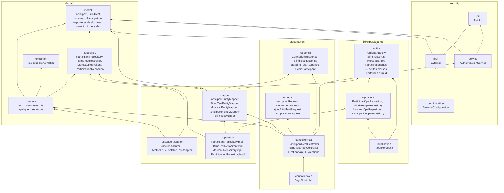
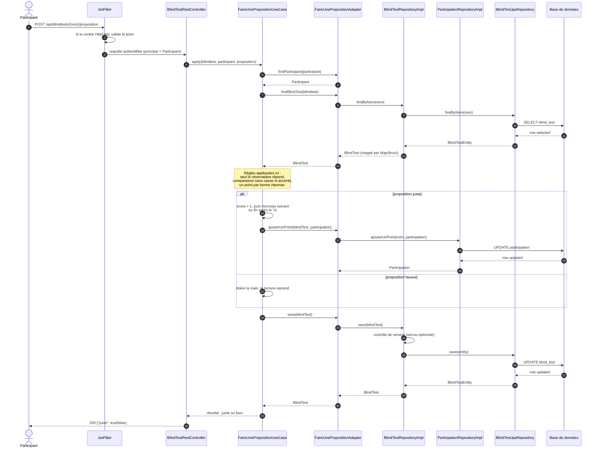
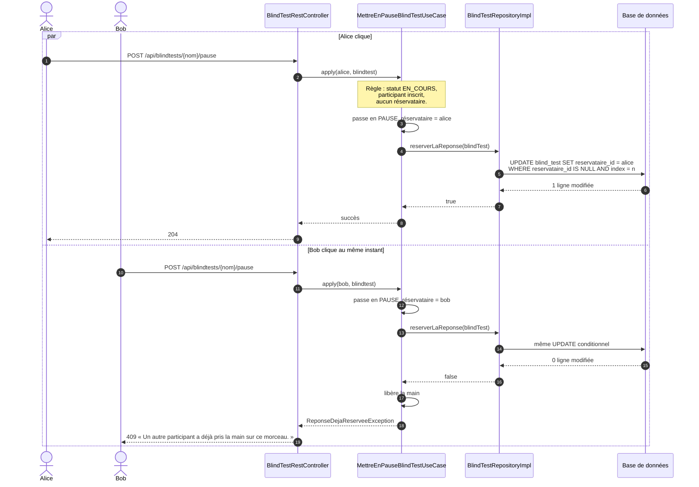

# Architecture

## 1. Diagramme de packages

La flèche se lit « dépend de ». Toutes les flèches pointent vers `domain` : c'est la règle
de dépendance vers l'intérieur.

Lecture des trois règles à retenir :

- `domain` n'a **aucune** flèche sortante vers `adapter`, `infra`, `presentation` ou `security`.
- `entity` (les entités JPA) n'est atteint que depuis `infra` et `adapter.mapper` : aucune entité
  de persistance ne remonte vers la présentation ni vers le domaine, et **l'identifiant technique
  ne sort jamais de cette couche**.
- `presentation` n'a **aucune** flèche vers `infra` : elle passe par les use cases et leurs ports.

Ces trois propriétés sont vérifiées automatiquement par
[ArchitectureTest](../src/test/java/com/esgi/blindTest/architecture/ArchitectureTest.java).

## 2. Diagramme de séquence — faire une proposition

Le scénario reprend l'interaction modélisée dans Visual Paradigm
(`UML/projet_blind_test.vpp`, diagramme « Mettre en pause + Faire une proposition »),
depuis l'envoi de la proposition jusqu'à la réponse. Les modèles étant de simples porteurs de
données, les règles sont appliquées par le use case lui-même.

## 3. Diagramme de séquence — arbitrage du premier clic

Le point délicat : trois participants peuvent cliquer « J'ai trouvé » en même temps.
La **règle** est appliquée par le use case, l'**ordre d'arrivée** est arbitré par la base.

La clause `WHERE ... AND reservataire_id IS NULL AND index_morceau_courant = :n`
est évaluée par la base après le verrou de ligne du premier `UPDATE` : il ne peut donc pas y
avoir deux gagnants, quel que soit l'entrelacement des requêtes.
